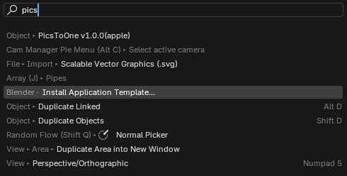
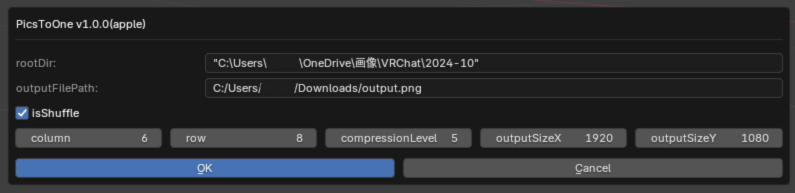

# PicsToOne

English:
This is a blender add-on that generates a single image from multiple images in a specified folder, arranged in specified columns and rows.

日本語:
画像が含まれるフォルダを指定すると、その画像を指定した列数と行数で一枚の画像を生成するblenderアドオンです。

# Demo (x.com)

https://x.com/arthur484_/status/1851913158296003043

# Download

English:
This is a volunteer project.  If you find it useful, please consider supporting my work by purchasing something from my shop. I would greatly appreciate it, and it will help me continue to improve ClipSync!

日本語:
ボランティア開発のため、あ～さ～のboothでなにか買ってくれたら、
跳ねて喜びます。今後のPicsToOneのバージョンアップにつながります。

[Arthur's booth shop](https://arthur484.booth.pm/)

[Download](https://github.com/arthur-vr/PicsToOne/releases)

# How to use

English:
- Press f3 and search for picsToOne.
- Specify the parent folder containing the images.
- Click the OK button.

日本語:
- f3を押してpicsToOneと検索。
- 画像がある親フォルダを指定する。
- OKボタンを押す。

# Panel Description

English:
- rootDir: Specify the parent folder containing the images.
- outputFilePath: Specify the image output file path.
- isShuffle: Specify whether to shuffle and arrange the images.
column: Specify the number of columns. (Number of images arranged horizontally)
- row: Specify the number of rows. (Number of images arranged vertically)
- compressionLevel: Specify the compression level. (0-9)
- outputSizeX: Specify the width of the output image.
- outputSizeY: Specify the height of the output image.
- OK: Save the settings and execute. Because it takes about 5-20 seconds depending on the number of images, it may appear to freeze for a moment, but please wait a little.

日本語:
- rootDir: 画像がある親フォルダを指定します。
- outputFilePath: 画像出力ファイルパスを指定します。
- isShuffle: 画像をシャッフルして並べるかどうかを指定します。
- column: 列数を指定します。(横に並べる数)
- row: 行数を指定します。(縦に並べる数)
- compressionLevel: 圧縮レベルを指定します。(0-9)
- outputSizeX: 出力画像の横幅を指定します。
- outputSizeY: 出力画像の縦幅を指定します。
- OK: 設定を保存して実行します。指定数に応じては、5-20秒くらいかかるので、一瞬フリーズするように見えますが、少しだけ待ってください。

